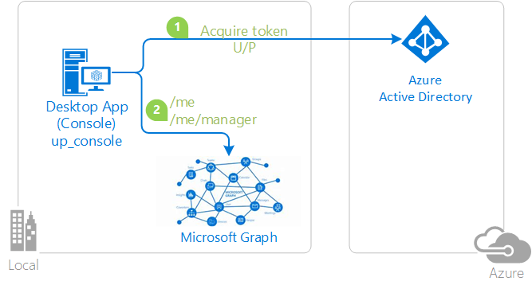

# Invoking an API protected by Azure AD with Username/Password

[](https://identitydivision.visualstudio.com/IDDP/_build/latest?definitionId=693)

## About this sample

### Overview

This sample demonstrates how to use MSAL.NET to:

- authenticate the user silently using username and password
- and call to a web API (in this case, the [Microsoft Graph](https://graph.microsoft.com))



If you would like to get started immediately, skip this section and jump to *How To Run The Sample*.

### Scenario

The application obtains tokens through username and passwords, and then call the Microsoft Graph to get information about the user who signed-in and their manager.

Note that Username/Password is needed in some cases (for instance devops scenarios) but it's not recommanded because:

- This requires having credentials in the application, which does not happen with the other flows
- This won't work for organizations that require conditional access, in particular multi-factor authentication.

Even if this flow seems simpler than the others, it's not. The error handling in particular is particularly complex (described in the sample)

## About the code

The code for handling the token acquisition process is simple, as it boils down to calling the `AcquireTokenByUsernamePasswordAsync` method of `PublicClientApplication`. See the `GetTokenForWebApiUsingUsernamePasswordAsync` method in `PublicAppUsingUsernamePassword.cs`.

```CSharp
private async Task<AuthenticationResult> GetTokenForWebApiUsingUsernamePasswordAsync(IEnumerable<string> scopes, string username, SecureString password)
{
 AuthenticationResult result = null;
 try
 {
  result = await App.AcquireTokenByUsernamePasswordAsync(scopes, username, password);
 }
 catch (MsalUiRequiredException ex) when (ex.Message.Contains("AADSTS65001"))
 {
   ...
   // error handling omited here (see sample for details)
 }
```

## How to run this sample

To run this sample, you'll need:

- [Visual Studio 2017](https://aka.ms/vsdownload) or just the [.NET Core SDK](https://www.microsoft.com/net/learn/get-started)
- An Internet connection
- A Windows machine (necessary if you want to run the app on Windows)
- An OS X machine (necessary if you want to run the app on OSX)
- A Linux machine (necessary if you want to run the app on OSX)
- An Azure Active Directory (Azure AD) tenant. For more information on how to get an Azure AD tenant, please see [How to get an Azure AD tenant](https://azure.microsoft.com/en-us/documentation/articles/active-directory-howto-tenant/)
- A user account in your Azure AD tenant. This sample will not work with a Microsoft account. If you signed in to the Azure portal with a Microsoft account (previously named live account) and have never created a user account in your directory before, you need to do that now.

### Step 1: Clone or download this repository

```Shell
git clone https://github.com/Azure-Samples/active-directory-dotnet-iwa-v2.git
```

or download and exact the repository .zip file.

> Given that the name of the sample is pretty long, and so are the name of the referenced NuGet pacakges, you might want to clone it in a folder close to the root of your hard drive, to avoid file size limitations on Windows.

### Step 2: Run the sample

Open the solution in Visual Studio, restore the NuGet packages, select the project, and start it in the debugger.

#### Operating the sample

When you run the sample, if you are running on a domain joined or AAD joined Windows machine, it will display your information as well as the information about your manager.

### Optional: configure the sample as an app in your directory tenant

The instructions so far used the Azure AD entry for the app in a Microsoft test tenant: given that the app is multitenant, anybody can run the sample against that app entry.
To register your project in your own Azure AD tenant, you can find instructions to manually provision the sample in your own tenant, so that you can exercise complete control on the app settings and behavior.

#### First step: choose the Azure AD tenant where you want to create your applications

As a first step you'll need to:

1. Sign in to the [Azure portal](https://portal.azure.com).
1. On the top bar, click on your account, and then on **Switch Directory**.
1. Once the *Directory + subscription* pane opens, choose the Active Directory tenant where you wish to register your application, from the *Favorites* or *All Directories* list.
1. Click on **All services** in the left-hand nav, and choose **Azure Active Directory**.

> In the next steps, you might need the tenant name (or directory name) or the tenant ID (or directory ID). These are presented in the **Properties**
of the Azure Active Directory window respectively as *Name* and *Directory ID*

#### Register the client app (active-directory-dotnet-iwa)

1. In the  **Azure Active Directory** pane, click on **App registrations** and choose **New application registration**.
1. Enter a friendly name for the application, for example 'active-directory-dotnet-iwa' and select 'Native' as the *Application Type*.
1. For the *Redirect URI*, enter `https://<your_tenant_name>/active-directory-dotnetcore-up`, replacing `<your_tenant_name>` with the name of your Azure AD tenant.
1. Click **Create** to create the application.
1. In the succeeding page, Find the *Application ID* value and record it for later. You'll need it to configure the Visual Studio configuration file for this project.
1. Then click on **Settings**, and choose **Properties**.
1. Configure Permissions for your application. To that extent, in the Settings menu, choose the 'Required permissions' section and then,
   click on **Add**, then **Select an API**, and type `Microsoft Graph` in the textbox. Then, click on  **Select Permissions** and select **User.ReadBasic.All**.

#### Configure the sample to use your Azure AD tenant

In the steps below, ClientID is the same as Application ID or AppId.

Open the solution in Visual Studio to configure the projects

#### Configure the client project

1. Open the `up-console\appsettings.json` file
1. Find the line where `Tenant` is set and replace the existing value with your tenant ID.
1. Find the line where `clientId` is set and replace the existing value with the application ID (clientId) of the `active-directory-dotnet-up` application copied from the Azure portal.

## Community Help and Support

Use [Stack Overflow](http://stackoverflow.com/questions/tagged/adal) to get support from the community.
Ask your questions on Stack Overflow first and browse existing issues to see if someone has asked your question before.
Make sure that your questions or comments are tagged with [`msal` `dotnet`].

If you find a bug in the sample, please raise the issue on [GitHub Issues](../../issues).

To provide a recommendation, visit the following [User Voice page](https://feedback.azure.com/forums/169401-azure-active-directory).

## Contributing

If you'd like to contribute to this sample, see [CONTRIBUTING.MD](/CONTRIBUTING.md).

This project has adopted the [Microsoft Open Source Code of Conduct](https://opensource.microsoft.com/codeofconduct/). For more information, see the [Code of Conduct FAQ](https://opensource.microsoft.com/codeofconduct/faq/) or contact [opencode@microsoft.com](mailto:opencode@microsoft.com) with any additional questions or comments.

## More information

For more information, see MSAL.NET's conceptual documentation:

- [Username/password](https://aka.ms/msal-net-up)
- [Customizing Token cache serialization](https://github.com/AzureAD/microsoft-authentication-library-for-dotnet/wiki/token-cache-serialization) (was not done in this sample, but you might want to add a serialized cache)

For more information about the Azure AD v2.0 endpoint see:

- [https://aka.ms/aadv2](https://aka.ms/aadv2)
